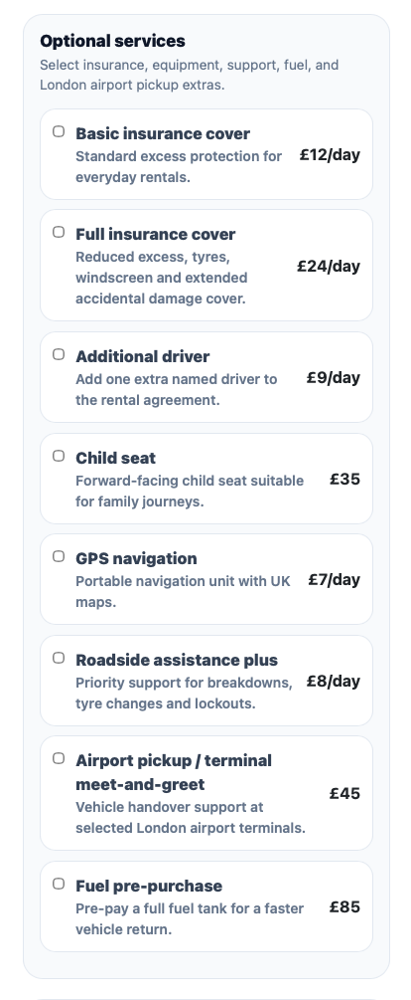
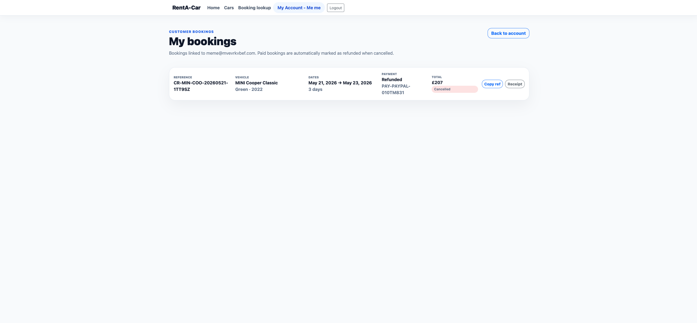
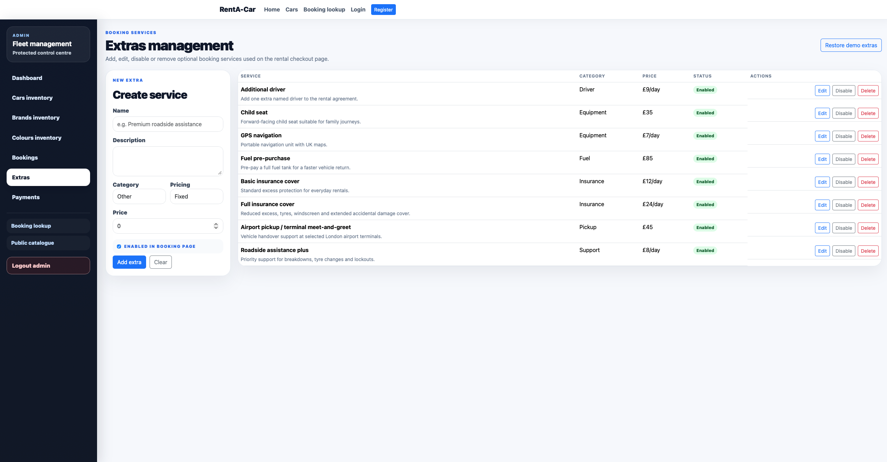
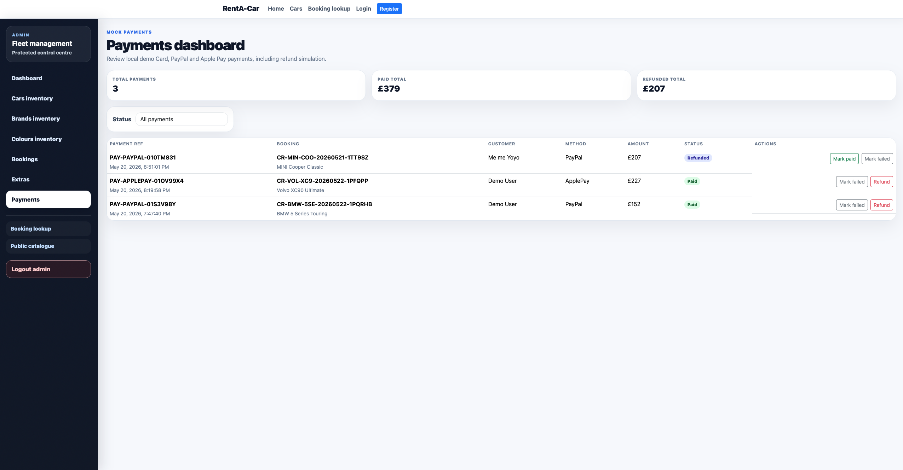

# RentA-Car London — Angular Local Rental Demo

RentA-Car London is a local-only Angular rental platform demo for browsing vehicles, creating bookings, selecting extras, simulating payments, managing customer accounts and administering fleet, bookings, extras and payments through a protected Admin area.

The application uses Angular services and `localStorage` as a mock persistence layer. No backend API is required for the demo flow.

## Current application status

This README reflects the application after the latest Homepage Professional Polish, Admin Extras, Payments, Refunds, Back-to-Top and cleanup update. The site now includes a polished public landing page, professional featured vehicle spotlight, popular fleet picks, trust/benefit cards, public vehicle catalogue, dynamic landing page vehicle, customer account flow, booking extras, London airport pickup terminals, mock checkout, booking receipts, protected Admin authentication, Admin inventory management, Admin extras management and Admin payment management.

## Screenshots

> Replace the screenshot files under `docs/screenshots/` with fresh browser captures whenever the UI changes. See `docs/screenshots/CAPTURE_GUIDE.md` for the recommended capture list.

| Area | Screenshot |
|---|---|
| Landing page |  |
| Cars catalogue |  |
| Car detail page |  |
| Booking extras and layout |  |
| Payment checkout |  |
| Booking receipt |  |
| Customer account |  |
| Customer bookings |  |
| Admin dashboard |  |
| Admin cars inventory |  |
| Admin extras |  |
| Admin payments |  |

## Functionality

### Public catalogue and landing page

- Professional landing page with a polished hero section.
- Dynamic featured vehicle spotlight selected from the local catalogue.
- Featured vehicle image/title links to the vehicle detail page.
- Featured vehicle booking CTA links to the rental flow.
- Featured vehicle card includes price, category, transmission, colour and pickup chips.
- Popular vehicle picks section generated from the local catalogue.
- Trust/benefits section highlighting local mock fleet, transparent pricing, London airport pickup and protected Admin.
- Polished How It Works flow covering vehicle selection, dates/extras, mock payment and booking management.
- Discreet Admin link in the bottom-right corner of the landing page.
- Cars catalogue with search, brand filter, colour filter, price range filtering and sorting.
- Back-to-top control on the public catalogue for long result pages.
- Vehicle cards with image fallback handling for missing or invalid image paths.
- Car detail page at `/cars/:carId` with large image, vehicle metadata, price, date selection and booking CTA.

### Booking workflow

- Rental flow at `/car/rental/:carId`.
- Improved two-column booking layout on desktop:
  - vehicle summary remains visible on the left;
  - booking form and optional services scroll in the right panel.
- Responsive single-column layout on mobile.
- Booking progress indicator.
- Pickup and return date selection.
- Selecting a pickup date automatically adjusts the return date when required.
- Rental duration selector with preset and custom day count options.
- Date-based rental price calculation.
- Availability conflict detection for overlapping bookings.
- Sticky booking total summary.
- Grouped and collapsible optional services.
- London pickup locations including major London airports and terminals:
  - Heathrow Terminal 2
  - Heathrow Terminal 3
  - Heathrow Terminal 4
  - Heathrow Terminal 5
  - Gatwick North Terminal
  - Gatwick South Terminal
  - Stansted Main Terminal
  - Luton Main Terminal
  - London City Main Terminal
  - Southend Main Terminal
- Booking extras/services selection:
  - Basic insurance cover
  - Full insurance cover
  - Additional driver
  - Child seat
  - GPS navigation
  - Roadside assistance plus
  - Airport pickup / terminal meet-and-greet
  - Fuel pre-purchase
- Admin-manageable extras catalogue.
- Price breakdown for vehicle subtotal, extras subtotal and grand total.
- Unique booking references generated using booking and vehicle data.
- Copy booking reference support.
- Booking lookup by reference and customer email.
- Back-to-top control on long booking/receipt views.

### Customer account flow

- Local demo customer registration.
- Local demo customer login/logout.
- Customer session stored in `localStorage`.
- Logged-in navbar state:
  - logged-out users see Login and Register;
  - logged-in users see `My Account - {FirstName}` and Logout.
- Customer account profile page at `/account`.
- Customer bookings page at `/account/bookings`.
- Account pages protected with a customer route guard.
- Customer booking cancellation for eligible bookings.
- Paid booking cancellation marks the associated mock payment as refunded.
- Back-to-top control on long customer booking views.

### Mock payment flow

- Payment page at `/payment/:bookingReference`.
- Demo payment methods:
  - Credit/debit card
  - PayPal
  - Apple Pay
- Payment records stored in `localStorage`.
- Payment reference generation using `PAY-*` style references.
- Payment status and method linked back to bookings.
- Payment statuses include paid, failed and refunded states.
- Booking receipt page at `/booking-confirmation/:bookingReference`.
- Receipt page includes booking details, selected services, payment method, payment reference and total paid.
- Print-friendly receipt styling for browser print/save-to-PDF.

### Protected Admin area

- Admin login page at `/admin/login`.
- Protected Admin routes using a demo Admin auth guard.
- Demo Admin credentials shown on the login page:
  - Username: `admin`
  - Password: `admin123`
- Admin logout returns to the Admin login page.
- Protected Admin navigation with links to:
  - Dashboard
  - Cars inventory
  - Brands inventory
  - Colours inventory
  - Bookings
  - Extras
  - Payments
  - Booking lookup
  - Public catalogue
- Dashboard metrics based on local booking data:
  - total bookings
  - pending bookings
  - confirmed bookings
  - active bookings
  - projected revenue
  - completed revenue
  - unavailable cars today
  - most booked brand
- Cars inventory management:
  - list cars
  - add car
  - edit car
  - delete car
  - admin-only number plate visibility
- Brands inventory management:
  - list brands
  - add brand
  - edit brand
  - delete brand
- Colours inventory management:
  - list colours
  - add colour
  - edit colour
  - delete colour
- Bookings management:
  - booking reference
  - customer
  - vehicle
  - internal number plate
  - selected extras/services
  - payment status
  - payment method
  - payment reference
  - booking status workflow
  - cancellation/refund handling for paid bookings
- Extras management at `/admin/extras`:
  - add extra
  - edit extra
  - disable extra
  - delete extra
  - reset demo extras
  - fixed and per-day pricing support
- Payments dashboard at `/admin/payments`:
  - view mock payment records
  - view booking reference, method, amount, status and transaction reference
  - mark payments as paid, failed or refunded

## Demo credentials

### Admin

```text
Username: admin
Password: admin123
```

### Customer

Create a customer account locally via:

```text
/register
```

Then log in via:

```text
/login
```

All customer, booking, extras and payment data is stored locally in the browser.

## Main routes

| Route | Purpose |
|---|---|
| `/home` | Polished landing page with dynamic featured vehicle and popular fleet picks |
| `/cars` | Public car catalogue |
| `/cars/:carId` | Car detail page |
| `/car/rental/:carId` | Booking flow |
| `/payment/:bookingReference` | Mock payment checkout |
| `/booking-confirmation/:bookingReference` | Booking receipt |
| `/booking-lookup` | Booking lookup by reference and email |
| `/register` | Customer registration |
| `/login` | Customer login |
| `/account` | Customer account profile |
| `/account/bookings` | Customer booking history |
| `/admin/login` | Admin login |
| `/admin/dashboard` | Admin dashboard metrics |
| `/admin/cars` | Admin cars inventory |
| `/admin/brands` | Admin brands inventory |
| `/admin/colors` | Admin colours inventory |
| `/admin/bookings` | Admin booking management |
| `/admin/extras` | Admin extras management |
| `/admin/payments` | Admin payments dashboard |

## Tech stack

- Angular 11
- TypeScript
- RxJS
- Bootstrap / CSS components
- `localStorage` mock persistence
- Angular route guards for customer and Admin protected areas

## Clone, install, build, test and start

### Clone

```bash
git clone https://github.com/victor-villar-turintech/Car-Rental-Angular.git
cd Car-Rental-Angular
```

### Install dependencies

```bash
npm install
```

### Start development server

```bash
npm start
```

Open:

```text
http://localhost:4200/
```

### Build

```bash
npm run build
```

The Angular build output is generated under `dist/`.

### Run unit tests

```bash
npm test
```

If you are running tests in a non-GUI environment, configure Chrome Headless in the Karma configuration first.

### Optional Angular CLI commands

```bash
npm run ng -- generate component components/example
npm run ng -- generate service services/example
```

## Local data reset

Because the demo uses `localStorage`, browser state can affect test bookings, accounts, extras and payments. To reset the app data during manual testing:

1. Open browser DevTools.
2. Go to Application / Storage.
3. Clear Local Storage for `http://localhost:4200`.
4. Refresh the app.

## Cleanup old documentation assets

The repository includes a cleanup helper for stale README screenshot assets and macOS zip metadata:

```bash
bash scripts/cleanup-old-readme-assets.sh
```

Run it after applying patch zips or replacing screenshots if old `__MACOSX` metadata or obsolete screenshot files appear in the working tree.

## Documentation screenshot refresh

Recommended screenshot files:

```text
docs/screenshots/home.png
docs/screenshots/catalogue.png
docs/screenshots/car-detail.png
docs/screenshots/booking-extras.png
docs/screenshots/payment.png
docs/screenshots/receipt.png
docs/screenshots/account.png
docs/screenshots/customer-bookings.png
docs/screenshots/admin-dashboard.png
docs/screenshots/admin-cars.png
docs/screenshots/admin-extras.png
docs/screenshots/admin-payments.png
```

Suggested capture flow:

```text
1. Run npm start.
2. Open the app at http://localhost:4200.
3. Capture the pages listed above.
4. For the landing page, capture both the hero/featured-vehicle section and the popular-vehicles/trust section.
5. Save/replace the PNG files under docs/screenshots/.
6. Commit README.md and docs/screenshots/* together.
```

## Notes

This project is intentionally local-only. Credentials, bookings, payments, extras, Admin sessions and customer sessions are demo data stored in the browser and should not be treated as production authentication or payment logic.
