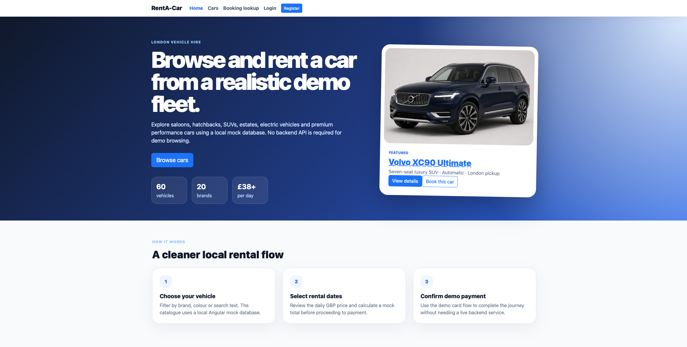
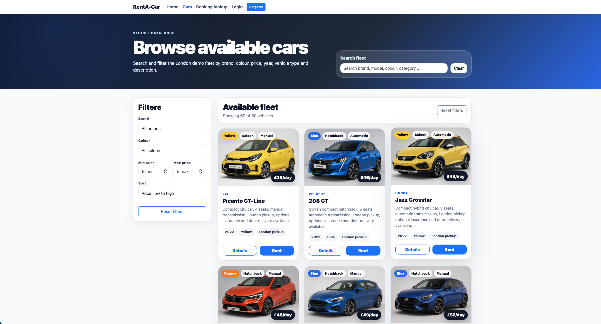
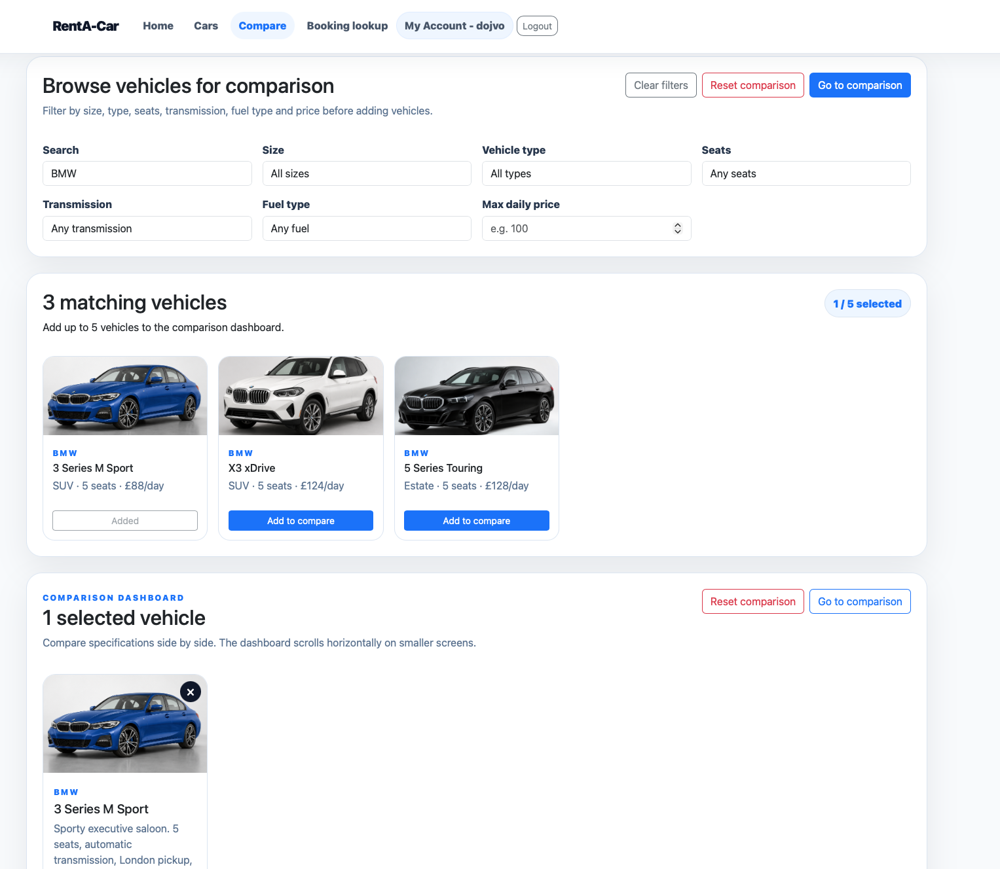
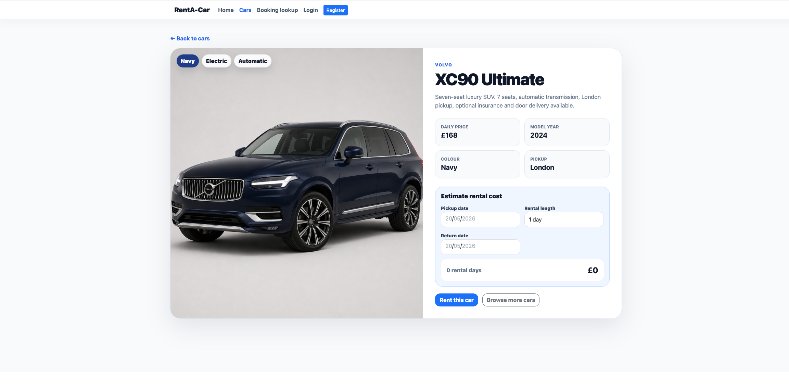
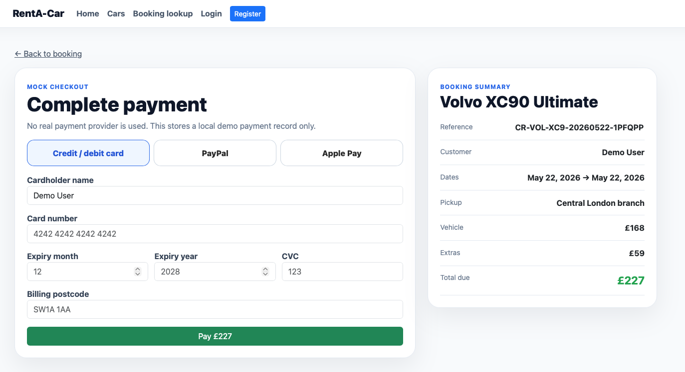
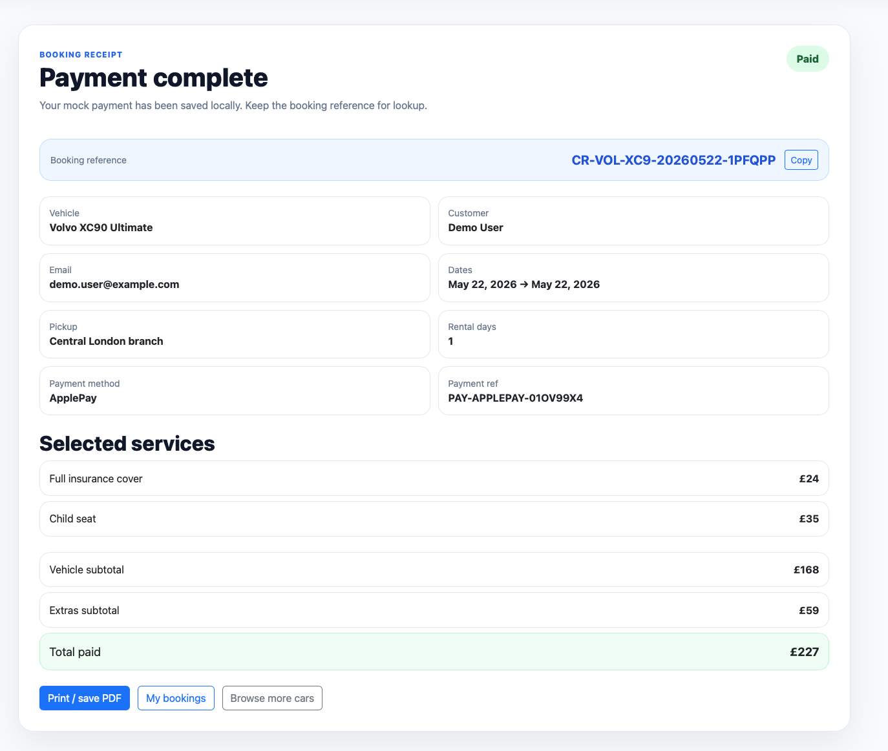
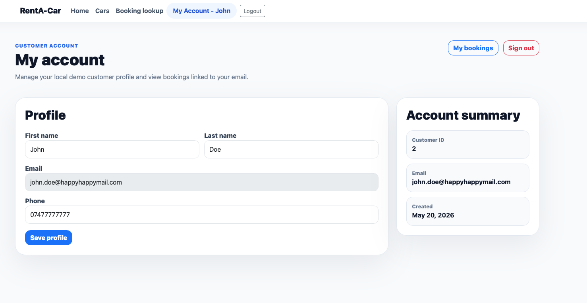
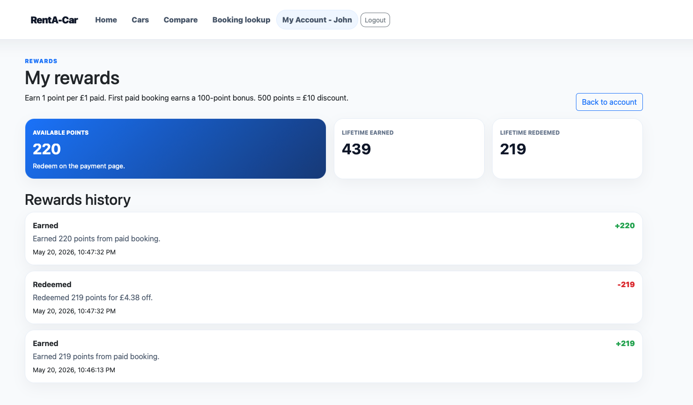
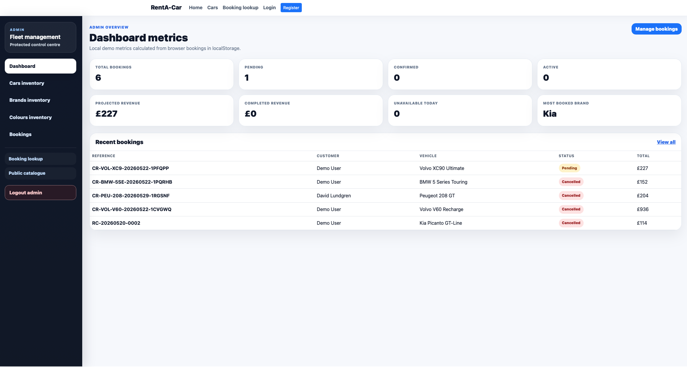
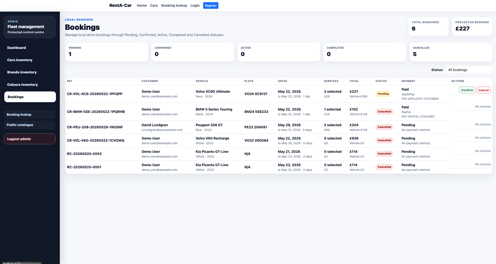

# Car Rental Angular Demo

Modern Angular car-rental demo application with a local mock catalogue, customer accounts, booking workflow, extras, payments, rewards, discount codes, vehicle comparison, and protected Admin tooling.

> The application is frontend-only and stores demo data in `localStorage`. It is designed as a UI/product workflow demo rather than a production rental backend.

## Current functionality

### Public website

- Professional homepage with a dynamic featured vehicle card, popular vehicle choices, trust/benefit cards, and a polished booking flow summary.
- Vehicle catalogue at `/cars` with search, filters, sorting, favourites, recently viewed vehicles, and direct Compare actions.
- Vehicle detail page at `/cars/:id` with vehicle information, image, price, specs, and booking CTA.
- Five-vehicle comparison dashboard at `/compare` with filters for size, vehicle type, number of seats, transmission, fuel type, and maximum daily price.
- Back-to-top controls on long catalogue, booking, account, receipt, and comparison pages.

### Booking flow

- Rental page at `/car/rental/:carId` with sticky vehicle details and a scrollable booking/options panel.
- Pickup and return date handling with duration presets and automatic return-date updates.
- London airport pickup locations and terminal-aware pickup options.
- Optional booking extras such as insurance, driver support, roadside assistance, airport services, equipment, and fuel options.
- Price breakdown with vehicle subtotal, extras subtotal, discounts, rewards redemption, and final total.
- Booking references generated from booking and vehicle information.
- Booking confirmation / receipt page with print-friendly styling.

### Payments

- Mock checkout at `/payment/:bookingReference`.
- Supports Card, PayPal, and Apple Pay demo flows.
- Payment references use a `PAY-*` format.
- Discount-code application with active/expired/minimum-spend/usage-limit validation.
- Reward-points redemption with clamping so users cannot redeem more points than available or more than the booking total can absorb.
- Receipts show payment method, payment reference, extras, discounts, rewards, and final total.

### Customer account

- Local customer registration and login.
- Logged-in navbar state shows account access and hides Login/Register.
- `/account` customer dashboard with profile details and links to bookings, rewards, activity, and favourites.
- `/account/bookings` shows customer booking history and eligible cancellation/refund simulation.
- `/account/favourites` shows favourite and recently viewed vehicles.
- `/account/rewards` shows points balance and reward transaction history.
- `/account/activity` shows customer activity such as registration, login, booking, payment, discount, reward, and cancellation events.

### Admin area

- Protected Admin login at `/admin/login`.
- Demo credentials are displayed on the login page:
  - Username: `admin`
  - Password: `admin123`
- Admin dashboard and sidebar navigation.
- Cars, brands, and colours inventory management.
- Admin Cars inventory includes richer vehicle specification visibility such as engine size, horsepower, range, seats, luggage capacity, boot capacity, drivetrain, fuel economy, and emissions band.
- Booking management with booking reference, customer, vehicle, dates, status, total, payment status, payment method, and payment reference.
- Extras management at `/admin/extras`.
- Payments dashboard at `/admin/payments` with paid/failed/refunded status simulation.
- Customer management at `/admin/customers` with search, booking count, total spend, points, enabled/disabled status, and mock reset-link generation.
- Customer activity log at `/admin/customer-activity`.
- Rewards management at `/admin/rewards`.
- Reward settings at `/admin/reward-settings`.
- Discount code management at `/admin/discounts`.
- Discount analytics at `/admin/discount-analytics`.
- Admin activity log at `/admin/activity`.
- Demo reset tools at `/admin/settings`.

## Screenshots

Screenshots are maintained under `docs/screenshots/`. The legacy `Readme-Images/` folder has been removed and should not be reintroduced.

| Area | Screenshot |
| --- | --- |
| Homepage |  |
| Vehicle catalogue |  |
| Vehicle comparison |  |
| Vehicle detail |  |
| Rental booking and extras |  |
| Payment checkout |  |
| Booking receipt |  |
| Customer account |  |
| Customer rewards |  |
| Customer favourites |  |
| Admin dashboard |  |
| Admin cars/specs |  |
| Admin customers |  |
| Admin discounts |  |
| Admin discount analytics |  |

If any image is missing locally, regenerate it using `docs/screenshots/CAPTURE_GUIDE.md` and save it using the exact filename shown above.

## Route map

| Route | Purpose |
| --- | --- |
| `/home` | Landing page with featured vehicle, popular choices, trust cards, and how-it-works section. |
| `/cars` | Searchable/filterable vehicle catalogue with favourites and Compare actions. |
| `/cars/:id` | Vehicle details page. |
| `/compare` | Browse and compare up to five vehicles. |
| `/car/rental/:carId` | Rental booking page with dates, pickup location, extras, and price breakdown. |
| `/payment/:bookingReference` | Mock checkout for Card, PayPal, and Apple Pay. |
| `/booking-confirmation/:bookingReference` | Booking confirmation and receipt. |
| `/booking-lookup` | Booking lookup by reference and customer email. |
| `/register` | Local customer registration. |
| `/login` | Local customer login. |
| `/account` | Customer account dashboard. |
| `/account/bookings` | Customer booking history. |
| `/account/favourites` | Favourite and recently viewed vehicles. |
| `/account/rewards` | Reward points and reward history. |
| `/account/activity` | Customer activity log. |
| `/admin/login` | Protected Admin login. |
| `/admin/dashboard` | Admin landing dashboard. |
| `/admin/cars` | Admin vehicle inventory and specification visibility. |
| `/admin/brands` | Admin brand management. |
| `/admin/colors` | Admin colour management. |
| `/admin/bookings` | Admin booking management. |
| `/admin/extras` | Admin booking extras management. |
| `/admin/payments` | Admin payments dashboard. |
| `/admin/customers` | Admin customer management. |
| `/admin/customer-activity` | Admin customer activity log. |
| `/admin/rewards` | Admin rewards management. |
| `/admin/reward-settings` | Admin reward scheme settings. |
| `/admin/discounts` | Admin discount code management. |
| `/admin/discount-analytics` | Admin discount usage analytics. |
| `/admin/activity` | Admin activity log. |
| `/admin/settings` | Admin demo reset tools. |

## Local data model notes

The demo uses local mock services and `localStorage` for persistence. This keeps the project easy to run without a backend, but it means data is browser-local and resettable.

Key local concepts:

- Vehicles and catalogue data come from local services/static data.
- Bookings are saved locally.
- Payments are mock records saved locally.
- Customers are local demo accounts.
- Rewards and reward transactions are local demo records.
- Discount codes are locally managed and validated.
- Admin authentication is demo-only.

## Requirements

This project uses an older Angular/Webpack stack. It can run on modern Node, but Node 17+ requires the OpenSSL legacy provider workaround.

Recommended:

```bash
node --version
npm --version
```

Known working approach with Node 20:

```bash
export NODE_OPTIONS=--openssl-legacy-provider
```

Alternative: use Node 14 or Node 16 via `nvm`.

## Install

```bash
git clone https://github.com/victor-villar-turintech/Car-Rental-Angular.git
cd Car-Rental-Angular
npm install
```

Do not run `npm audit fix --force` casually on this project. The repo uses Angular 11-era dependencies and force-fixing can introduce breaking framework/package changes.

## Build

For Node 17+ / Node 20:

```bash
export NODE_OPTIONS=--openssl-legacy-provider
npm run build
```

For Node 14/16, the environment variable may not be needed:

```bash
npm run build
```

Autoprefixer warnings about `start` / `end` alignment are non-blocking.

## Test

```bash
npm test -- --watch=false
```

If Karma/Chrome setup hangs or fails locally, stop it with `Ctrl + C` and use `npm run build` plus the manual validation checklist below as the primary validation path.

## Start

```bash
export NODE_OPTIONS=--openssl-legacy-provider
npm start
```

Open:

```text
http://localhost:4200
```

## Manual validation checklist

After a clean build, validate:

```text
/home
/cars
/compare
/cars/1
/car/rental/1
/payment/<booking-reference>
/booking-confirmation/<booking-reference>
/account
/account/bookings
/account/favourites
/account/rewards
/account/activity
/admin/login
/admin/dashboard
/admin/cars
/admin/bookings
/admin/extras
/admin/payments
/admin/customers
/admin/customer-activity
/admin/rewards
/admin/reward-settings
/admin/discounts
/admin/discount-analytics
/admin/activity
/admin/settings
```

Specific behaviours to confirm:

- Homepage featured vehicle card links to vehicle detail and rental booking.
- Catalogue filters work and Compare actions navigate to `/compare`.
- Compare page starts empty, supports Add to compare, Reset comparison, and up to five vehicles.
- Compare dashboard scrolls horizontally on smaller screens.
- Booking page keeps vehicle details visible while the options panel scrolls.
- Payment applies discount codes and reward points correctly.
- Reward points cannot exceed available balance or payable amount.
- Customer account pages show bookings, favourites, rewards, and activity.
- Admin login protects Admin routes.
- Admin Cars shows richer vehicle specs.
- Admin Customers, Rewards, Discount Codes, Discount Analytics, Activity Log, and Demo Reset pages load.

## Demo reset / localStorage cleanup

Use the Admin Demo Settings page when possible:

```text
/admin/settings
```

Or clear browser storage manually:

```js
localStorage.clear();
```

Then refresh the app.

## Repository hygiene

- Current screenshots belong in `docs/screenshots/`.
- Do not use or restore `Readme-Images/`; it was the old README asset structure.
- Keep patch branches short-lived and merge into `main` after validation.
- After merging, perform a fresh clone from `main` and run `npm install`, `npm run build`, and `npm start`.

## Suggested next refactor

The Admin Cars page now exposes richer vehicle specs, but the long-term data model should separate catalogue specifications from physical fleet vehicles:

```text
/admin/vehicle-catalogue
- Shared make/model/spec data: engine size, horsepower, range, seats, drivetrain, fuel type, boot capacity, emissions, body type.

/admin/fleet
- Physical vehicle instances: catalogue model, colour, number plate, status, mileage, location, availability.
```

That separation would allow multiple fleet units of the same make/model while only changing number plate, colour, mileage, location, and availability.


## Favourite vehicle recovery

The catalogue supports local favourite vehicles using browser localStorage. Customers can save vehicles using the heart control on catalogue cards, then review saved and recently viewed vehicles from `/account/favourites`. Recently viewed vehicles are updated when opening vehicle details or booking from the favourites page.


## Favourite vehicles

- The catalogue and booking pages include favourite controls; favourites are persisted locally and visible under the customer account favourites page.


### Favourite vehicles

Customers can save vehicles from the catalogue using the full circular heart control on each vehicle card. The booking page also includes an explicit `Add to favourites` / `Saved to favourites` action near the selected vehicle details, and saved vehicles are available under `/account/favourites` using localStorage-backed persistence.

### Favourite vehicle UI note

Catalogue cards expose a visible circular heart control inside the vehicle image area. The full heart control is clickable and persists favourites locally so saved vehicles appear under the customer favourites page.

- Favourite heart controls are aligned inside the top-right corner of catalogue cards with a full circular clickable target.

- Catalogue favourite hearts use compact top-right controls so they do not overlap vehicle feature badges.
